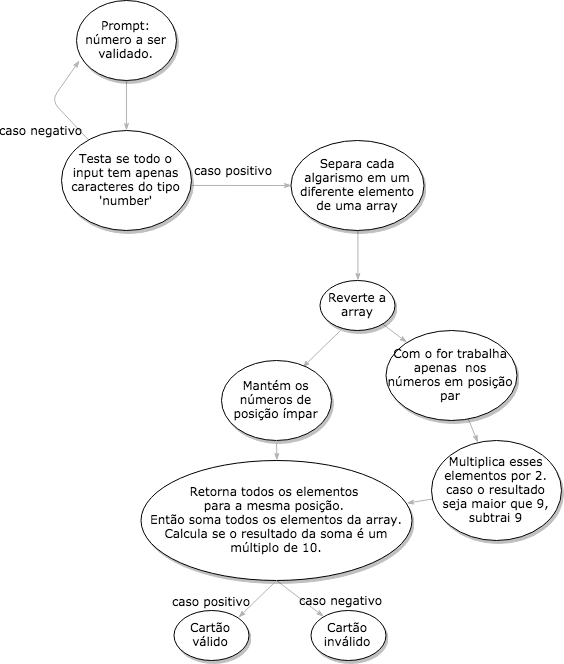

Laboratória 
Sprint 1 - Produto Final

CARTÃO DE CRÉDITO VÁLIDO    
Esse código, escrito em JavaScript, valida o <input>número do cartão de crédito<input> de acordo com o algorítimo de Luhn.

Antes de fazer a validação do número do cartão, o código checa se é um input válido, ou seja, se foi digitado apenas números. Se positivo, o programa segue para a validação, se negativo, o programa pede ao usuário que digite um número válido. O último comando é repetido até que o input seja apenas do tipo 'number'.

O algorítimo de Luhn valida um número de acordo com os passos abaixo:
1). Reverte o número original;
2). Para os números em posição par: multiplica por 2, caso o resultado tenha dois algarismos, deve-se somá-los entre si. (Essa soma equivale com subtrair 9 do resultado, como foi feito nesse código);
3). Somar os números das posições ímpares com os novos números obtidos nas posições pares;
4). Caso o resultado dessa soma seja um múltiplo de 10, o número do input é considerado válido, caso contrário, inválido.

- Para seguir esse passos, primeiro foi necessário colocar os números, que entraram pelo prompt como 'string', em uma array. Com isso tornou-se possível manipular os números de forma independente.
- Com o 'for' foi possível passar apenas pelos números em posição par na array reversa e assim seguir o passo 2 da validação.
- Com os novos valores na array, com um novo 'for' foi percorrida toda a array e somando cada valor a variável 'sum'.
- Usando o operador '%' verifica se o valor de 'sum' é um múltiplo de 10, chegando a validação final. 

Fluxograma do código JavaScript

